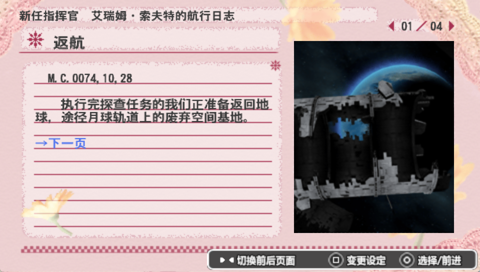

# PSP游戏《异形战机战略版2：苦涩巧克力行动》中文本地化项目

[![][black-shield]][black]

[![][black-shield2]][black2]

[black]: https://img.shields.io/badge/License-MIT-black.svg?style=for-the-badge&labelColor=gray
[black-shield]: https://img.shields.io/badge/License-MIT-black.svg?style=for-the-badge&labelColor=gray
[black2]: https://im.qq.com
[black-shield2]: https://img.shields.io/badge/QQ_GROUP-726729364-black.svg?style=for-the-badge&labelColor=gray

此仓库为PSP游戏《异形战机战略版2：苦涩巧克力行动》的中文本地化项目仓库地址。

# 汉化预览

    
点击展开汉化预览

# 雷点提醒
项目作者并非职业的本地化工作者，虽然作者已进行多次校对工作，但依然无法保证不会出现重大纰漏，还望各位玩家海涵。如有发现明显问题，还请通过提交Issue的方式告知作者，亦可选择加入群聊进行实时反馈。
本地化工作可谓是众口难调，一个决定通常难以满足所有人的需求或者符合所有人的审美。此区域尽量将所有的雷点提前罗列出来，帮助用户提前避雷。
因为部分雷点可能涉及剧透，所以采用折叠处理。

    
点击展开雷点提醒

1) 本项目修改了大量的贴图素材，如主菜单的“MAIN MENU”图标、各种各样的数字、和原版按钮不一致的字体、等等（[汉化预览](#汉化预览)区域内有部分素材预览）；
2) 本项目的翻译含有相当数量的艺术加工。为了使行文更有逻辑、更加流畅、更符合实际表现，可能会有部分文本和原文的表述不完全一致；
3) 为了提升文本的丰富性，相当数量的重复文本（比如决战兵器系列的波动冲击锥）或者译者认为“无趣”的地方（如决战舰首炮的描述）被改写；
4) 游戏本体内含有大量的文字描述和实际表现不一致的情况，亦或者前文和后文不一致的情况。本项目尽可能地对每一处不一致的地方进行了矫正（注：是否进行数值修改可由用户自行选择，详情请查看[数值修改](#数值修改)区域），但也因此无法保证“原汁原味”；
5) 部分关键字的字体颜色被更改，比原版文本的关键字高亮更为丰富；
6) 本项目内存在部分整活性质的文本，这部分文本在玩家使用金手指修改游戏内存时可能会被调出。

# 数值修改
为了使描述文本和游戏内的实际表现维持一致，项目作者对多处游戏数值进行了修改。您可以在[此文档](STATSMOD.md)内查看所有修改过的数值。如果您对文档内的数值修改不满意，您可以选择不包含数值修改的补丁。
如果您是新玩家，此前从未游玩过原本游戏，那么作者强烈建议您直接使用包含了数值修改的补丁进行游戏，并在游戏通关后再查看修改文档。如果您是老玩家，作者也建议您尝试使用数值修改补丁，说不定会找到一丝新鲜感。

# 安装方法
1) 获取原版游戏的原版镜像文件（本项目仓库不提供任何镜像文件的传播）
   - 注：仅有未修改过的原版镜像可以使用本补丁
2) 前往本项目的[发布](https://github.com/hiroshi-ya/RTT2_CHS_Localization/releases)界面
3) 获取补丁安装程序`DeltaPatcher.exe`
4) 获取补丁：
   - `rtt2_chs_patch.xdelta`不包含数值修改（原版数值+汉化补丁）
   - `rtt2_chs_mod_patch.xdelta`包含数值修改（数值改动+汉化补丁）
   - 以上补丁文件二选一即可
5) 打开`DeltaPatcher.exe`：
   1) 在`Original File`的文件选择器里选择您的原版镜像
   2) 在`Xdelta patch`的文件选择器里选择步骤4中下载的补丁（二选一）
   3) （可选）点击`Apply patch`右侧的小齿轮，勾选`Backup original file`（备份原文件）
   4) 点击`Apply patch`安装补丁
   5) 如提示`Patch successfully applied!`则安装成功

# 自行搭建
如果您希望从零开始自行搭建项目，请参考[自建指南](BUILD.md)。

# 免责声明 (Disclaimer)

本项目是一个非盈利的开源项目，旨在与游戏爱好群体、个人开发者群体、业余本地化工作者开展技术交流与文化交流。本项目不是一个版权内容的二次分发项目，项目作者已尽可能保证项目内不含有任何可能导致侵权的二次分发行为。如果您在本项目内发现有任何未获得许可的内容分发行为，请您与作者进行联系，作者会在第一时间向版权拥有者道歉并删除所有版权内容。

This project is a non-profit open-source project intended to initiate technical and/or cultural discussions between enthusiastic players, independent developers, and fan translators. This project is not aiming at distributing any copyrighted material in anyway whatsoever. The author of this project is putting every effort into making sure that no copyrighted material is unlawfully re-distributed. If you find any unlicensed copyrighted material in this project, please let the author know so the author can apologize to the copyright owner and delete the copyrighted content as soon as possible.