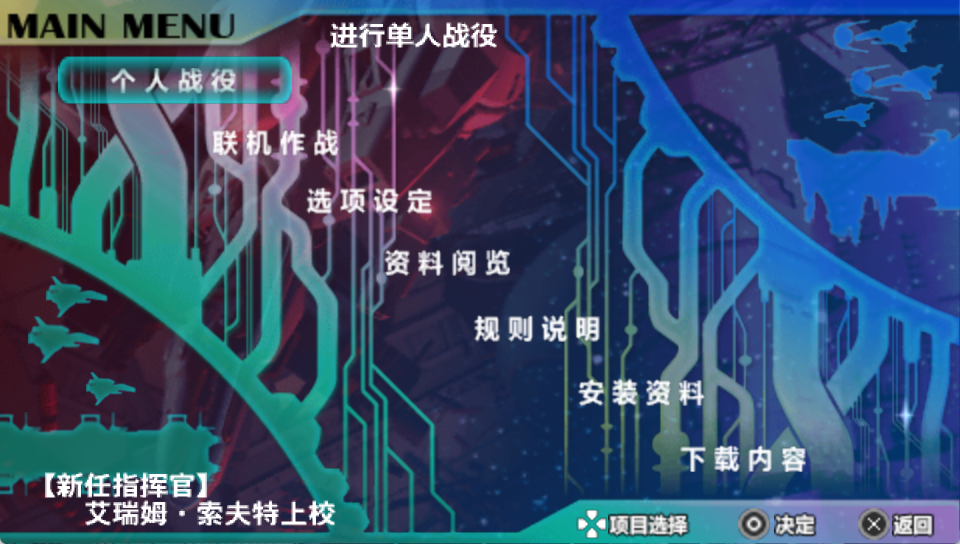
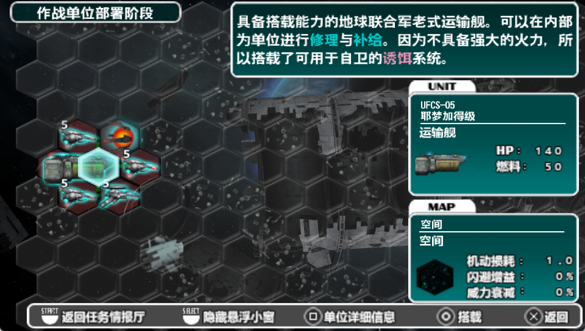
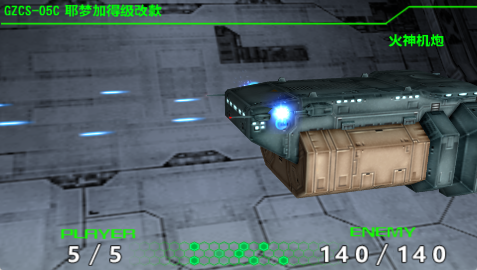
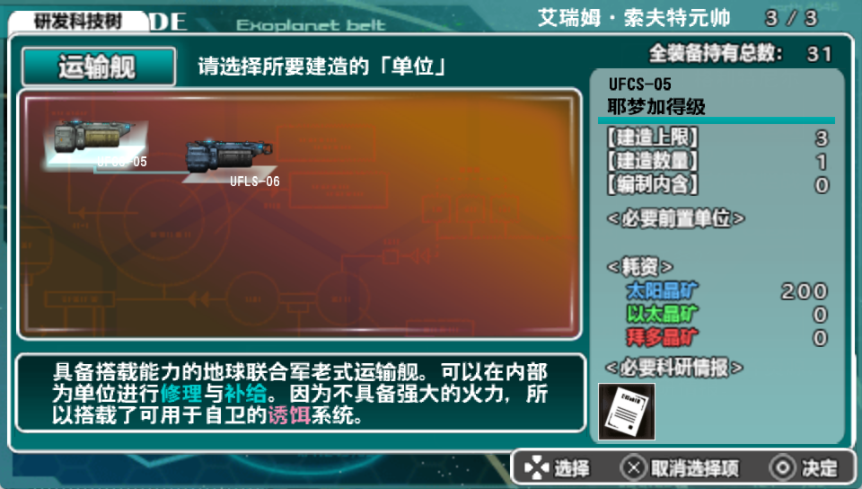
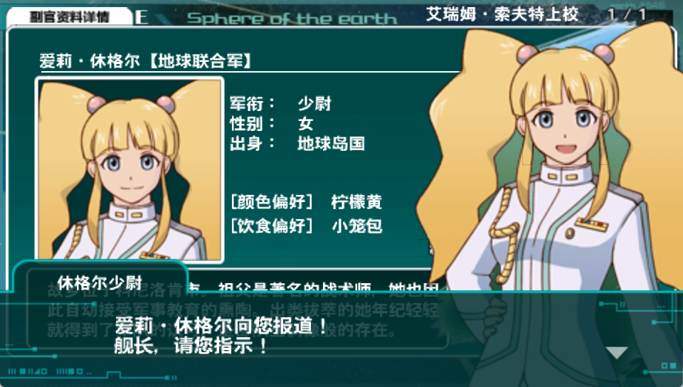

# PSP游戏《异形战机战略版2：苦涩巧克力行动》中文本地化项目

此仓库为PSP游戏《异形战机战略版2：苦涩巧克力行动》的中文本地化项目仓库地址。

本项目为开源项目，遵循MIT开源协议。

加入讨论群：
[![][black-shield2]][black2]

[black2]: https://im.qq.com
[black-shield2]: https://img.shields.io/badge/QQ_GROUP-718945618-black.svg?style=for-the-badge&labelColor=gray

# 汉化预览

<details>
    <summary>点击展开</summary>












</details>


---
items:
- first
- second
- third

1) one
2) two
3) three

**ok** *this* <ins>is</ins> <ins>***crazy***</ins>

inline math: $\text{formula}=\frac{x}{2}+y+\cos{222}$

block math:

$$
    \text{F}(\omega) = \sum_{n=0}^{N-1} \exp\left({\frac{-2j\pi n\omega}{N}}\right)\text{f}(n)
$$

This is an external [link](https://www.google.com/search?q=link).

This is an internal [link](./sources/).

Table:
|Left|Middle|Right|
|:---|:---:|---:|
|0|0|0|
|1|1|1|

This is a c++ code block:
```c++
#include <iostream>
using namespace std::cout;
cout << "Hello world\n";
```

This is a python code block:
```python
from time import sleep
print("I'm going to sleep")
sleep(1E6)
```

This is a piece of `inline` code.